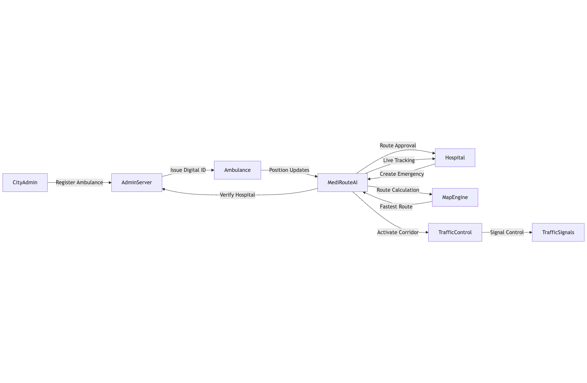
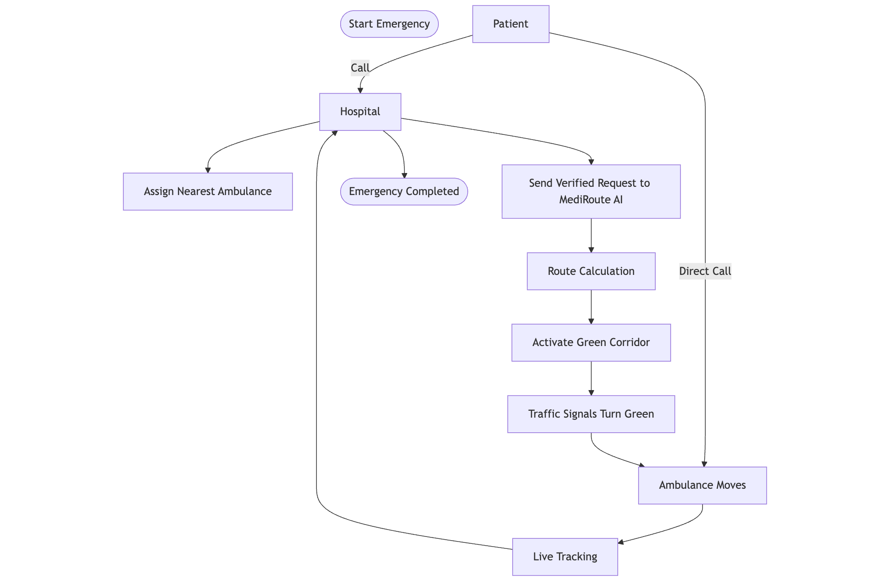

# MediRoute AI - Smart Ambulance Navigation System

## 🌐 Live Website
👉 https://mediroute-ai-main.vercel.app/

## 🎥 Project Demo Video
👉 https://drive.google.com/drive/folders/1SaYn1xqYD6Y-XTptdFiBdox-okxGlThD?usp=sharing

A real-time ambulance tracking and traffic signal priority system that helps save lives by ensuring clear routes for emergency vehicles.

## 🏗️ System Architecture



The MediRoute AI system consists of interconnected components:

- **CityAdmin**: Manages ambulance registration and fleet oversight
- **AdminServer**: Handles authentication and verification processes  
- **Ambulance**: Real-time GPS tracking and emergency response
- **Hospital**: Emergency management and route coordination
- **MediRouteAI Core**: Route optimization and traffic control system
- **MapEngine**: Route calculation and navigation services
- **TrafficControl**: Automated traffic signal management
- **TrafficSignals**: Physical traffic infrastructure integration

## 🔄 Emergency Workflow



The emergency response follows a streamlined process:

1. **Emergency Initiation** - Patient calls hospital or emergency services
2. **Hospital Response** - Verifies emergency and assigns nearest ambulance
3. **Route Calculation** - AI calculates optimal route considering traffic
4. **Green Corridor Activation** - Automatic traffic signal priority
5. **Live Tracking** - Real-time updates to hospital and patient
6. **Emergency Completion** - Arrival confirmation and system reset

## 🚑 Features

- **Real-time GPS Tracking** - Live location tracking of ambulances with accurate positioning
- **Traffic Signal Priority** - Automatic traffic signal control to clear paths for emergencies
- **Multi-role Dashboard** - Separate interfaces for ambulance drivers, hospital staff, and administrators
- **Emergency Token System** - Streamlined emergency request management
- **Live Route Optimization** - Dynamic routing based on traffic conditions
- **Hospital Integration** - Real-time ETA updates for incoming ambulances

## 🛠️ Tech Stack

- **Frontend**: React 18, TypeScript, Tailwind CSS
- **UI Components**: shadcn/ui, Radix UI
- **Backend**: Supabase (PostgreSQL, Auth, Real-time)
- **Maps**: Leaflet, React-Leaflet
- **Deployment**: Vercel
- **Build Tool**: Vite

## 🚀 Quick Start

### Prerequisites
- Node.js 18+ and npm
- Supabase account
- Vercel account (for deployment)

### Installation

1. **Clone the repository**
   ```bash
   git clone https://github.com/puneetkumargarg/mediroute-ai.git
   cd mediroute-ai
   ```

2. **Install dependencies**
   ```bash
   npm install --legacy-peer-deps
   ```

3. **Environment Setup**
   Create a `.env` file in the root directory:
   ```env
   VITE_SUPABASE_PROJECT_ID="your-project-id"
   VITE_SUPABASE_PUBLISHABLE_KEY="your-anon-key"
   VITE_SUPABASE_URL="https://your-project-id.supabase.co"
   ```

4. **Database Setup**
   - Create a new Supabase project
   - Run the migrations in the `supabase/migrations/` folder
   - Or use Supabase CLI:
     ```bash
     supabase link --project-ref your-project-id
     supabase db push
     ```

5. **Start Development Server**
   ```bash
   npm run dev
   ```
   The app will be available at `http://localhost:8080`

## 📱 User Roles

### 🚑 Ambulance Driver
- Real-time location tracking
- Emergency status management
- Route navigation with traffic signal priority
- Hospital destination selection

### 🏥 Hospital Staff
- Monitor incoming ambulances
- View real-time ETAs
- Emergency request management
- Patient preparation coordination

### 👨‍💼 Administrator
- Manage ambulance fleet
- Driver registration and approval
- System monitoring and analytics
- Traffic signal configuration

## 🗄️ Database Schema

### Core Tables
- `profiles` - User profiles with role-based access
- `ambulances` - Ambulance fleet management
- `emergency_tokens` - Emergency request tracking
- `hospitals` - Hospital information
- `traffic_signals` - Traffic signal locations and status

## 🚀 Deployment

### Vercel Deployment

1. **Connect to Vercel**
   ```bash
   npm install -g vercel
   vercel login
   vercel --prod
   ```

2. **Environment Variables**
   Add these in Vercel dashboard:
   - `VITE_SUPABASE_PROJECT_ID`
   - `VITE_SUPABASE_PUBLISHABLE_KEY`
   - `VITE_SUPABASE_URL`

3. **Domain Configuration**
   - Set your Vercel domain in Supabase Auth settings
   - Configure redirect URLs for authentication

## 🔧 Development

### Available Scripts

```bash
npm run dev          # Start development server
npm run build        # Build for production
npm run preview      # Preview production build
npm run lint         # Run ESLint
```

### Project Structure

```
src/
├── components/          # Reusable UI components
│   ├── ui/             # shadcn/ui components
│   └── ...             # Custom components
├── hooks/              # Custom React hooks
├── pages/              # Page components
├── types/              # TypeScript type definitions
├── integrations/       # External service integrations
└── lib/                # Utility functions
```

## 🔐 Authentication

The system uses Supabase Auth with role-based access control:

- **Email/Password Authentication**
- **Role-based Routing**
- **Protected Routes**
- **Session Management**

## 🗺️ Maps Integration

- **Leaflet** for interactive maps
- **Real-time Location Updates**
- **Route Visualization**
- **Traffic Signal Markers**
- **Hospital Locations**

## 🚨 Emergency Workflow

The system follows an intelligent emergency response process:

### Phase 1: Emergency Initiation
- Patient calls hospital or directly contacts emergency services
- Hospital staff verify the emergency and assess severity
- System identifies nearest available ambulance

### Phase 2: Route Optimization
- MediRoute AI calculates optimal route using real-time traffic data
- Multiple route options generated considering:
  - Current traffic conditions
  - Road closures and construction
  - Hospital capacity and specialization
  - Ambulance location and availability

### Phase 3: Green Corridor Activation
- Traffic signals along the route automatically receive priority commands
- Signals turn green in sequence as ambulance approaches
- Real-time coordination with traffic management systems

### Phase 4: Live Tracking & Updates
- Continuous GPS tracking of ambulance location
- Real-time ETA updates sent to hospital
- Patient/family notifications with progress updates
- Route adjustments based on changing conditions

### Phase 5: Completion & Reset
- System confirms ambulance arrival at hospital
- Traffic signals return to normal operation
- Emergency token marked as completed
- Performance metrics logged for analysis

## 🤝 Contributing

1. Fork the repository
2. Create a feature branch (`git checkout -b feature/amazing-feature`)
3. Commit your changes (`git commit -m 'Add amazing feature'`)
4. Push to the branch (`git push origin feature/amazing-feature`)
5. Open a Pull Request

## 📄 License

This project is licensed under the MIT License - see the [LICENSE](LICENSE) file for details.


## 🙏 Acknowledgments

- Emergency services for inspiration
- Open source mapping communities
- Healthcare technology innovators

---

**MediRoute AI** - Saving lives through smart technology 🚑
